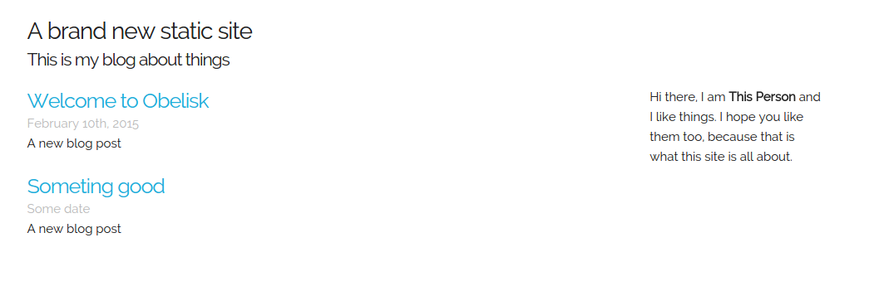

# skelington

A very simple Obelisk theme using the [Skeleton
framework.](http://getskeleton.com)

## Installation

>> *NOTE*: Obelisk version `0.9.0` is requied for this theme to work.

To install the Skelington theme, add the following entry to your `site.yml`
file.

    theme: 'obelisk-ex/skelington

The next time that you run `$ mix obelisk build`, Obelisk will pull down the
theme and install it for you.

If you'd like to update the theme to the latest version, simply delete
`./themes/skelington` and run `$ mix obelisk build` again.

## Example

## Settings

The following settings can be adjusted in `site.yml`.

* `name`: Will update the title bar and main heading.
* `description`: Will be included as the sub heading.
* `bio`: Will update the sidebar text. This can be any _HTML_ content that you
  like

